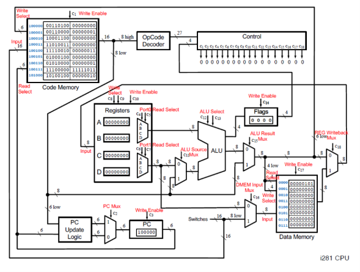

# Week 5 - Single Cycle CPU Design

## Objective

Design and implement a simplified CPU capable of executing a bubble sort algorithm. Your processor should be able to read an unsorted array from memory, sort it, and write the sorted array back into the memory.

---

## Architectural Overview

---

## References

Refer to the i281 slides in the resources folder.

Also read sections 5.1 - 5.4 in david_patterson.pdf text.

i281 Simulator - https://www.ece.iastate.edu/~alexs/classes/i281_simulator/index.html

---

## Submission Guidelines

Push all the Verilog design files along with the screenshots of simulation waveforms showing register file contents and data memory contents.
